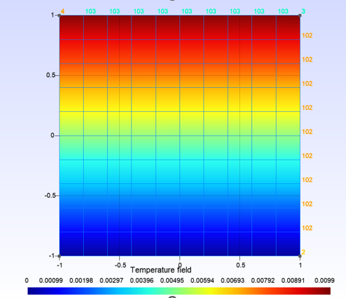
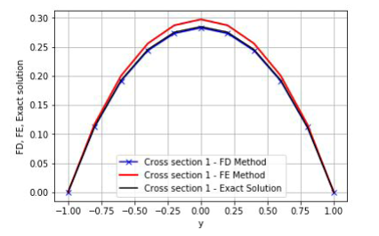

# Stationary Thermal Analysis Problem

To make a 2D finite elements program using python which can solve stationary thermal analysis problem with the following main features.
- 2D Domain
- The elements are 4 nodes bi-linear quadrangular elements formulated in the physical space.
- Isotropic Conductivity is assumed.
- Homogeneous Boundary conditions are only considered. (zero Dirichlet boundary conditions)

## Algorithm

## Results for specific Boundary conditions
Under the following Boundary conditions,
- u = 0 on line 101
- r=0 (source term)
- Unit flux on line 103
- Conductivity 202 as per our group B-02.

# Comparison between Exact solution of 2d Problem with FE and FD method

]